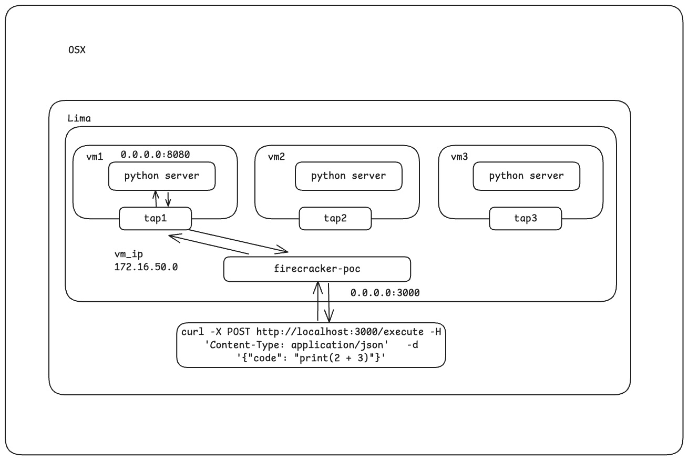

# Firecracker POC

A proof-of-concept project demonstrating secure Python code execution in isolated microVMs using AWS Firecracker virtualization technology.



## Overview

This project provides a secure sandbox environment for executing Python code using Firecracker microVMs. It features:

- **Secure Isolation**: Python code execution in lightweight, secure microVMs
- **REST API**: Axum-based web server with clean JSON responses
- **HTTP API Communication**: VM-host communication via HTTP for reliable execution
- **VM Pooling**: Pre-warmed VM pool for optimized latency (<1s for subsequent requests)
- **Unique Network Isolation**: Each VM gets its own subnet (172.16.x.0/24) preventing conflicts
- **Smart TAP Interface Management**: Prevents cleanup conflicts between active VMs
- **Test-Friendly**: Unit tests run without sudo requirements using intelligent test detection
- **Cross-Platform**: Runs on macOS using Lima VMs with KVM support
- **Production Ready**: Comprehensive test suite with robust error handling

## Architecture

```
┌─────────────────┐    ┌─────────────────┐    ┌─────────────────┐
│   Client        │───▶│   Rust Backend  │───▶│  VM Pool        │
│   (HTTP)        │    │   (Axum Server) │    │  (Pre-warmed)   │
└─────────────────┘    └─────────────────┘    └─────────────────┘
                                │                       │
                                ▼                       ▼
                       ┌─────────────────┐    ┌─────────────────┐
                       │   Lima VM       │    │  Firecracker    │
                       │   (x86_64)      │    │   microVMs      │
                       └─────────────────┘    │  + HTTP API     │
                                              │  + TAP Networks │
                                              └─────────────────┘
```

### Key Components

- **VM Pool**: Pre-warmed Firecracker VMs ready for immediate code execution
- **HTTP API Server**: Python server running inside each VM on port 8080
- **TAP Networking**: Each VM gets unique subnet (172.16.x.0/24) for isolation
- **Smart Cleanup**: Active VM interfaces protected from cleanup conflicts

## Prerequisites

- **macOS**: Intel or Apple Silicon (project runs in x86_64 Lima VM)
- **Lima**: For VM management (`brew install lima`)
- **QEMU**: For x86_64 virtualization (`brew install qemu`)
- **Rust**: Latest stable version
- **Node.js & Yarn**: For UI development

## Setup

### 1. Clone and Build

```bash
git clone <repository-url>
cd firecracker-poc
cargo build
```

### 2. Create Lima VM

```bash
# Create x86_64 VM with KVM support
make create-linux

# Verify VM is running
limactl list
```

### 3. Setup Firecracker in VM

```bash
# SSH into the Lima VM
lima firecracker-vm

# Run setup script (inside VM)
./scripts/setup_firecracker.sh
```

### 4. Start the Server

```bash
# In the host system
cargo run
```

The server will start on `http://localhost:3000`

### 5. Start the UI (Optional)

```bash
cd ui
yarn install
yarn dev
```

The UI will be available on `http://localhost:5173`

## Usage

### API Endpoints

#### Execute Python Code

```bash
POST /execute
Content-Type: application/json

{
  "code": "print(2 + 2)"
}
```

**Response:**

```json
{
  "stdout": "4\n",
  "stderr": "",
  "success": true
}
```

#### Health Check

```bash
GET /health
```

**Response:**

```json
{
  "status": "healthy"
}
```

### Example Usage

```bash
# Simple calculation
curl -X POST http://localhost:3000/execute \
  -H "Content-Type: application/json" \
  -d '{"code": "result = 10 * 5\nprint(f\"Result: {result}\")"}'

# File operations (sandboxed)
curl -X POST http://localhost:3000/execute \
  -H "Content-Type: application/json" \
  -d '{"code": "import os\nprint(os.listdir(\"/\"))"}'

# Error handling
curl -X POST http://localhost:3000/execute \
  -H "Content-Type: application/json" \
  -d '{"code": "print(undefined_variable)"}'
```

## Development

### Running Tests

```bash
# Run all tests (no sudo required)
cargo test

# Run tests with output
cargo test -- --nocapture

# Run specific test that was previously hanging
cargo test test_execute_endpoint_structure

# Lint code
cargo clippy
```

**Note**: All tests now run without requiring sudo access. The test framework automatically detects test mode and mocks VM operations while still testing the actual handler logic and API endpoints.

### Project Structure

```
├── src/                   # Rust backend source
│   ├── main.rs           # Server entry point
│   ├── lib.rs            # Library exports
│   └── runner.rs         # Firecracker integration
├── ui/                    # React frontend
│   ├── src/
│   └── components/
├── fixtures/              # Configuration files
│   └── machine.json      # Firecracker VM config
├── scripts/               # Setup and utility scripts
└── specs/                 # Project specifications
```

### Key Features

- **Optimized Latency**: VM pooling reduces execution time from 6-12s to <1s for subsequent requests
- **Network Isolation**: Each VM gets unique subnet preventing routing conflicts
- **HTTP Communication**: Reliable VM-host communication via HTTP API instead of complex init scripts
- **Smart Resource Management**: TAP interfaces only cleaned up when not in use by active VMs
- **Test-Safe Operations**: Unit tests automatically skip sudo operations and VM creation
- **Clean Output**: Returns only Python execution results, no VM logs
- **Error Handling**: Comprehensive error reporting and recovery
- **Security**: Isolated execution environment with no host access
- **Monitoring**: Health checks and status reporting

## Configuration

### VM Pool Settings

The following constants can be configured in `src/runner.rs`:

```rust
const VM_BOOT_TIMEOUT_SECONDS: u64 = 15;     // VM boot timeout
const VM_EXECUTE_TIMEOUT_SECONDS: u64 = 35;   // Code execution timeout
const VM_POOL_SIZE: usize = 3;                // Maximum VMs in pool
pub const VM_PREWARM_COUNT: usize = 2;        // VMs to pre-warm at startup
```

### Firecracker VM Settings

The VM configuration is stored in `fixtures/machine.json`:

```json
{
  "machine-config": {
    "vcpu_count": 1,
    "mem_size_mib": 256,
    "track_dirty_pages": true
  }
}
```

### Network Configuration

- **Unique Subnets**: Each VM gets subnet `172.16.x.0/24` where `x` is derived from VM ID
- **Host IP**: `172.16.x.1` (TAP interface on host)
- **VM IP**: `172.16.x.2` (VM API server)
- **API Port**: `8080` (HTTP API server inside VM)

### Lima VM Configuration

The Lima VM is configured in `linux.yaml` for x86_64 with nested virtualization.

## Troubleshooting

### Common Issues

1. **TAP Interface Conflicts**: Fixed with unique subnet assignment per VM
2. **VM Pool Latency**: Optimized with pre-warming (now <1s for subsequent requests)
3. **Test Hanging on Sudo**: Fixed with intelligent test detection
4. **Multiple VMs Same Network**: Fixed with 172.16.x.0/24 unique subnets
5. **KVM Access Denied**: Ensure user has KVM permissions in Lima VM
6. **CPU Template Errors**: Remove cpu_template from machine config for compatibility
7. **Architecture Mismatch**: Verify Lima VM is running x86_64 architecture
8. **Nested Virtualization**: Check that your system supports nested virtualization

### Debug Mode

Enable verbose logging:

```bash
RUST_LOG=debug cargo run
```

## Testing

The project includes comprehensive tests covering:

- **API Endpoint Functionality**: All HTTP endpoints with various input scenarios
- **VM Pool Management**: VM creation, reuse, and cleanup logic
- **Network Isolation**: TAP interface management and unique subnet assignment
- **Error Handling**: Comprehensive error scenarios and recovery
- **Resource Cleanup**: Proper cleanup of VM resources and network interfaces
- **Test-Safe Operations**: Tests run without sudo requirements using intelligent mocking

### Test Performance

- **No Sudo Required**: Tests automatically detect test mode and skip system operations
- **Fast Execution**: All tests complete in <1 second
- **Comprehensive Coverage**: Tests actual handler logic while safely mocking VM operations
- **Reliable**: All tests pass consistently across different environments

### Key Test Improvements

- Fixed hanging `test_execute_endpoint_structure` test
- Eliminated sudo dependency for unit tests
- Maintained test coverage of actual business logic
- Added smart test detection using `cfg!(test)` and runtime checks

## Contributing

1. Fork the repository
2. Create a feature branch
3. Make your changes
4. Run tests: `cargo test && cargo clippy`
5. Submit a pull request

## License

This project is distributed under the terms of MIT.

See [LICENSE](LICENSE.md) for details.

Copyright 2025 Tyr Chen
